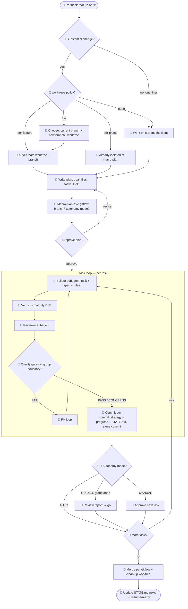

# @weloin/claude-skills

Weloin's [Claude Code](https://claude.com/claude-code) skills library — install with one command, updates via symlink. macOS · Linux · Windows.

---

## `weloin:project-setup`

A phase-machine for agent-driven development. Instead of ad-hoc prompting, it runs your project through structured phases — from first interview to shipped code — with every decision recorded and resumable.

**What you get**

- An interview that produces your brief, requirements, architecture, and ADRs.
- A custom agent roster with model tags matched to each role.
- Phased plans executed at your chosen AUTO / GUIDED / MANUAL autonomy.
- A `docs/project/STATE.md` single source of truth — close a session mid-phase, resume days later without re-explaining anything.
- Works on fresh directories or aligns an existing codebase to the same structure.

**Why it holds up**

- **Durable state.** Agent sessions lose context; this makes project state survive across them.
- **Maturity axis** (prototype → mvp → production) sets the quality bar independent of scale — prototypes skip ceremony but log every shortcut to a debt ledger; `promote` later upgrades by re-asking skipped questions and building a hardening plan from that ledger.
- **Evidence-based gates.** Opt-in quality gates mean work isn't "done" until it passes review with proof — not when the agent says so.
- **Strategy that fits.** A 15-strategy catalog with a project-kind recommendation matrix, not one-size-fits-all.
- **Configurable Git workflow.** Commit strategy (style · detail · AI-signature) and worktree policy (per-phase / per-feature / ask / none) set once, applied automatically.
- **Never frozen.** Every config field has a subcommand to re-set it later; changes apply going forward, never restructuring existing work.

Full subcommand reference & opt-in features → **[docs/project-setup.md](./docs/project-setup.md)**.

### Quick install

```bash
npm install -g @weloin/claude-skills   # then:
weloin-skills                          # pick skills interactively
```

Full install, update, and CLI reference → **[docs/installation.md](./docs/installation.md)**.

### What execution looks like (per feature / fix)

Once set up, every substantial change runs the same loop — 🧑 = you decide, 🤖 = Claude acts. Config (`worktrees`, `autonomy`, `gitflow`, `commit_strategy`) steers the branches without re-asking.



Deeper walk-through → **[docs/execution-flow.md](./docs/execution-flow.md)**.

---

## Docs

- **[Installation & CLI](./docs/installation.md)** — install, update, uninstall, command/flag reference
- **[project-setup reference](./docs/project-setup.md)** — subcommands, opt-in features
- **[Execution flow](./docs/execution-flow.md)** — per-feature loop, human ↔ Claude gates
- **[Development](./docs/development.md)** — how installs work, adding a skill, troubleshooting
- **[Changelogs](./changelogs/)**

## License

MIT © Weloin
