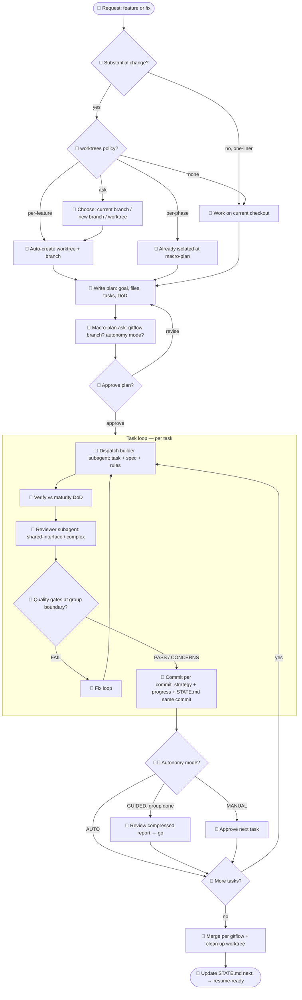

# project-setup — Per-Feature / Per-Fix Execution Flow

How a single substantial change runs after the project is set up. 🧑 = human decides · 🤖 = Claude acts. Config fields (`worktrees`, `autonomy`, `gitflow`, `commit_strategy`) steer the branches automatically.

## Reading the flow

- **Human gates (🧑):** isolation choice when policy = `ask`, the macro-plan ask, plan approval, and the autonomy pause points (GUIDED at group boundaries, MANUAL per task). AUTO removes the per-task pauses but plan approval and artifact gates still hold.
- **Claude acts (🤖):** everything else — isolation setup, planning, the builder/reviewer/gatekeeper subagents, commits, merge, and the STATE.md update that makes the next session resume-ready.
- **Config steers, doesn't re-ask:** `worktrees` picks the isolation branch, `gitflow` the branch model, `commit_strategy` the commit shape, `autonomy` the pause cadence — all set once, applied every change.
- **Invariant:** every task's progress checkbox + `STATE.md next:` land in the *same commit* as the work — that's the resume guarantee.
